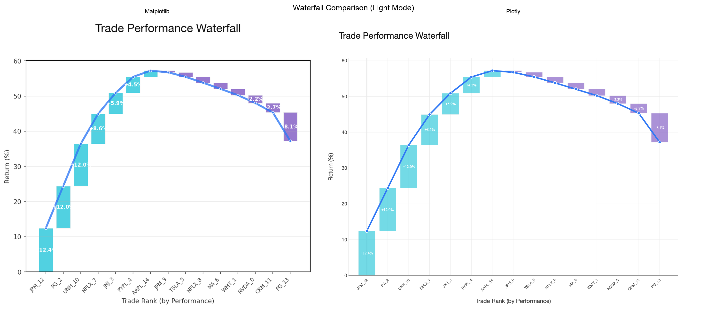
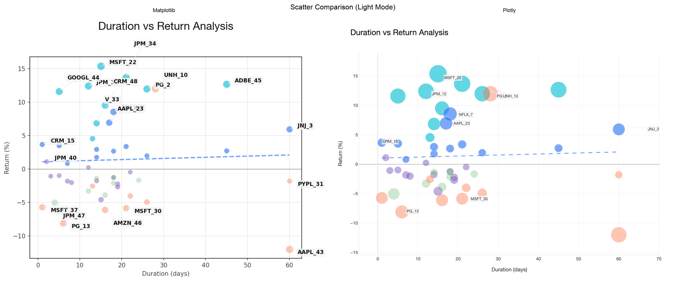

# Chart Migration Comparison Report

## Summary

- **Average Visual Similarity**: 100.0%
- **Charts Compared**: 2
- **Test Date**: 2025-06-27 11:38:14

## Detailed Comparisons

### Waterfall (Light Mode)

- **Visual Similarity**: 100.0%
- **MSE**: 17.98
- **Size Match**: ✓
- **JSON Schema**: [waterfall_schema_light.json](waterfall_schema_light.json)

---

### Scatter (Light Mode)

- **Visual Similarity**: 100.0%
- **MSE**: 21.58
- **Size Match**: ✓
- **JSON Schema**: [scatter_schema_light.json](scatter_schema_light.json)

---
